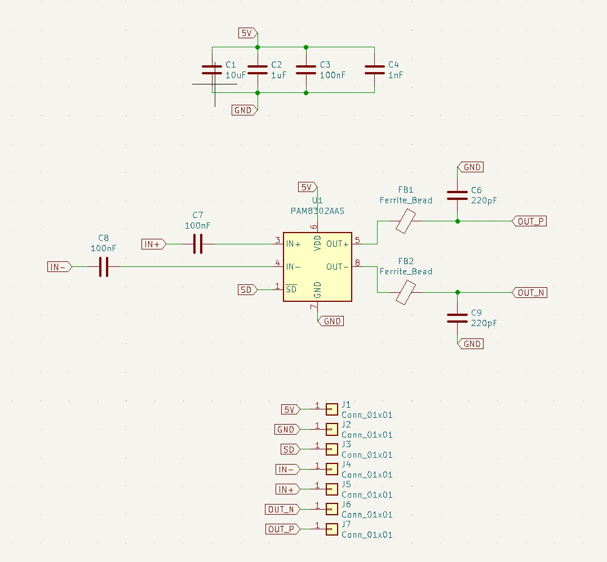

# 10_Audio_Facile

Le module Audio_Facile permet d'amplifier un signal électrique analogique pour piloter un haut-parleur.

La licence est celle du CERN Open Hardware Licence version 2; CERN-OHL-P ; permissive.
Le fichier de cette license est présent dans le répertoire: cern_ohl_p_v2.txt

# Photos

# Schéma et fonctionnement

Ci-joint le schéma de la version de 

Le module est basé sur la puce PAM
Il faut l'alimenter avec une tension 5V +-5% (typiquement celle de l'USB classique) sur la pin Vext. (Ne pas oublier GND bien sûr).

## Fonctionnalités
- Petit (23x18 mm)
- Faible coût (2 couches avec composants d'un seul côté)
- Connecteur avec pas de 2.54 mm + empreinte crénelée pour connexion carte à carte

## Outils utilisés

- [Kicad V6](https://www.kicad.org/)

## Fabrication du circuit

Ce circuit a été testé de fond en comble sur de nombreux projets

## Contributeurs

- Thierry Orlandi ([Hardware Freelance](https://www.linkedin.com/in/thierry-orlandi))
- Yohann Belair ([R&D Freelance](https://github.com/ciborg971))

## Licence
[CERN Open Hardware Licence Version 2](https://github.com/Thierry-oshw/10_Audio_Facile/blob/main/LICENSE.txt)